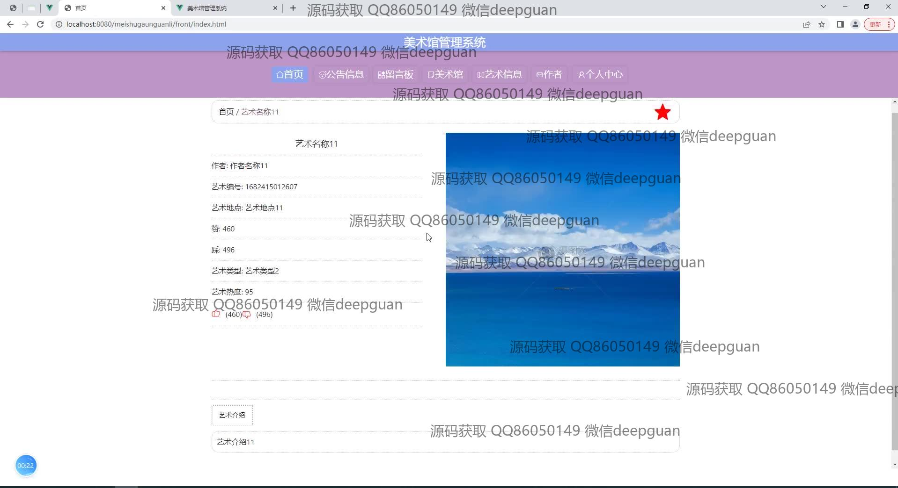

<h1 align="center">美术馆管理系统</h1>

## 简介
美术馆管理系统：角色分为管理员、用户；功能包括艺术品管理、用户与作者信息管理、留言板交流、公告信息以及展览安排，提升美术馆运营效率与用户体验。    --计算机毕业设计源码；毕设源码；java毕业设计源码

## 联系方式

<h3 align="center">获取完整代码与数据库文件 + 微信：deepguan QQ: 86050149 QQ群: 783742310</h3>

<h3 align="center">可帮忙远程部署 包运行成功！提供远程部署、修改代码、设计文档指导、代码讲解等服务！</h3>

## 功能介绍（完整见运行截图）
管理员： 基本功能包括登录、注册和退出，具有管理美术馆日常运营的权限。首页展示导航栏和艺术作品，并含有公告信息和留言板功能。可以通过用户、作者、艺术品管理模块进行信息录入、修改和删除。能够管理展览安排、公告信息、留言板和单位预约，支持艺术收藏管理和发布新的艺术作品信息。具备搜索、过滤功能和综合管理界面，包括公告信息管理和作者信息管理模块，有利于系统全面高效地管理。

用户： 通过注册、登录可以访问系统，主界面包括导航栏、艺术信息和个人中心模块。用户能够查看艺术品详细信息和展览安排，有留言板功能以便与管理人员沟通。可以更新账户信息如头像、电话和邮箱，通过个人中心管理个人信息。支持艺术作品的点赞、评论和收藏，方便用户与管理员交流，收集反馈意见提升体验。

## 运行截图

本代码来源于网络,仅供学习参考使用!

